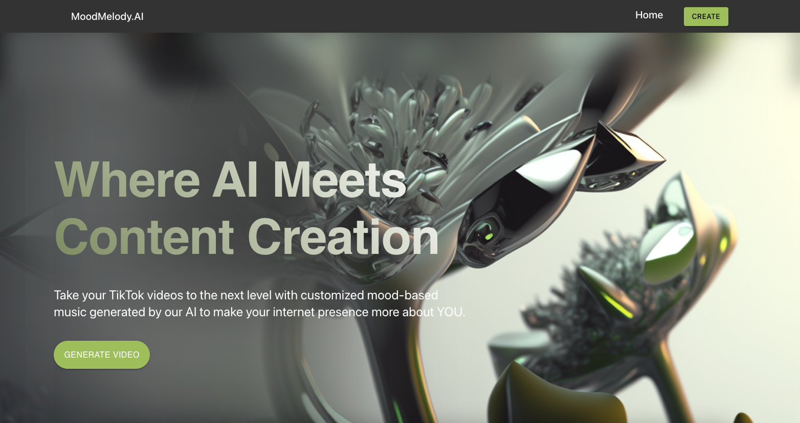
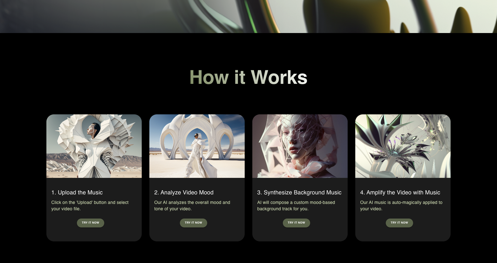
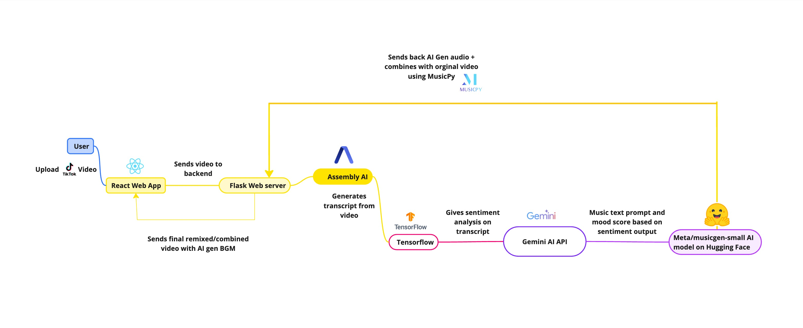
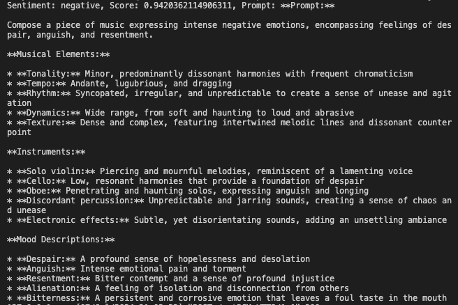

# MoodMelody-AI

## Inspiration

Our project aims to revolutionize how we experience video content by seamlessly integrating custom-generated music that aligns with the video's emotional tone. Imagine uploading a video and receiving a perfectly matched soundtrack that enhances the viewer's emotional journey. This is the innovation we aspire to create. As huge fans of the Inside Out 2 movie, we decided to centre our entire product on the idea that emotion-based content creation can help content creators connect with their audience. 

In the hustle and bustle of our daily lives, music has the power to evoke emotions, calm our minds, and enhance our experiences. We wanted to leverage this powerful medium to create an innovative tool that combines the art of music with the science of AI. Inspired by the idea of translating human emotions captured in videos into personalized music tracks, we embarked on the journey of creating MoodMelodyAI. Our goal was to build a solution that not only understands the emotions conveyed in videos but also enhances them with custom-generated music, providing a unique and immersive experience for users.

## What It Does

MoodMelodyAI is an AI-powered application that generates custom music based on the emotional content of video transcripts. Here’s how it works:

1. User Uploads a Video: Users start by uploading a video to the MoodMelodyAI platform.
2. Video-to-Transcript Conversion: The uploaded video is converted into a text transcript using the Assembly AI API.
3. Sentiment Analysis: The transcript is analyzed to determine the dominant emotions conveyed in the video using TensorFlow and Gemini AI API.
4. Music Generation: Based on the identified emotions, MoodMelodyAI generates a custom music track that complements the mood of the video using a Hugging Face AI music gen model.
5. Downloadable Link: The generated music is then combined with the video, and users are provided with a download option to the final product.

## How We Built It

1. GitHub Repository: We finalized and set up our project repository on GitHub to manage and track our code collaboratively.
2. UI/UX Design: Initial designs were created in Figma, focusing on an intuitive and aesthetically pleasing user interface.
3. API Research: We researched and selected appropriate APIs for converting video to transcripts.
4. Backend Development: We set up the foundation of our backend using Flask, providing a robust and scalable environment for our application.
5. Frontend Development: We employed React.js and Material UI for the frontend, ensuring a dynamic and responsive user experience.
6. Music Generation: Leveraged AI models, including those from Gemini AI API and Audiocraft, to create custom music tracks based on emotional analysis.

## Challenges We Ran Into

1. API Integration: Integrating multiple APIs and ensuring seamless communication between them posed a significant challenge.
2. Emotion Analysis Accuracy: Achieving accurate sentiment analysis from transcripts to generate appropriate music tracks required extensive tuning and testing.

3. Time Constraints: Balancing the project’s scope with the limited timeframe of the hackathon was challenging, leading to the prioritization of core features over additional functionalities.
4. File Size Management: Handling large video files and ensuring efficient processing and storage within practical limitations was another key challenge.
5. Hosting Issues: We ran out of time to host the frontend and backend, so for now users would have to clone the repo and follow instructions on the README file to test out our web app. 

## Accomplishments That We're Proud Of

1. Functional Prototype: Successfully developed a functioning prototype that can analyze video transcripts and generate custom background music tracks.
2. Collaborative Effort: The team worked collaboratively across time zones, making critical decisions and overcoming obstacles together.
3. User-Friendly UI: Created an intuitive and aesthetically pleasing user interface that enhances user experience.

## What We Learned

1. API Integration Skills: Improved our skills in integrating and working with various APIs.
2. AI and Sentiment Analysis: Gained deeper insights into AI-driven sentiment analysis and its applications in creative projects.
3. Time Management: Learned the importance of prioritizing tasks and managing time effectively within the constraints of a hackathon.
4. Collaborative Development: Enhanced our ability to work as a cohesive team, communicating effectively and sharing responsibilities.

## What's Next For MoodMelodyAI

1. Facial Emotion Recognition: Expand the project to include facial emotion recognition for a more comprehensive analysis of the video’s emotional content instead of only pertaining to textual mood analysis.
2. Enhanced Music Generation: Improve the music generation algorithms to produce even more personalised and high-quality music tracks.
3. Scalability: Optimize the platform to efficiently handle larger, longer videos.
4. User Feedback Integration: Gather user feedback to refine and enhance the application’s features and usability.
5. Mobile Application: Develop a mobile version of MoodMelodyAI to reach a wider audience and provide on-the-go accessibility.

## The Talented Team
- [Stephanie Nhi Le](https://github.com/StephanieNhiLe) - Backend
- [Vishal Pugazhendhi](https://github.com/PV1shal) - Backend
- [Divyalakshmi Varadha Rajan Prem Sudha](https://github.com/Divyatech-hub) - Frontend
- [Ye (Maggie) Tian](https://github.com/) - UI/UX 